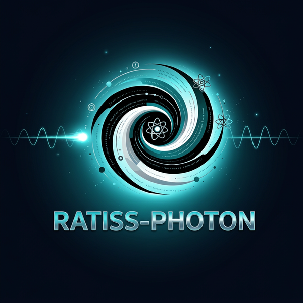
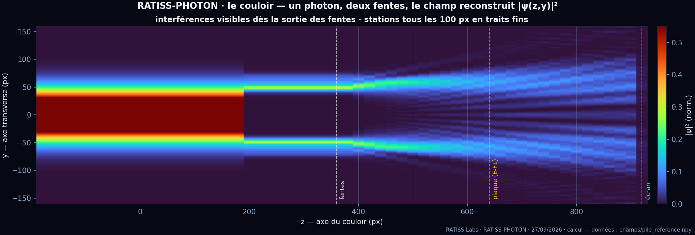
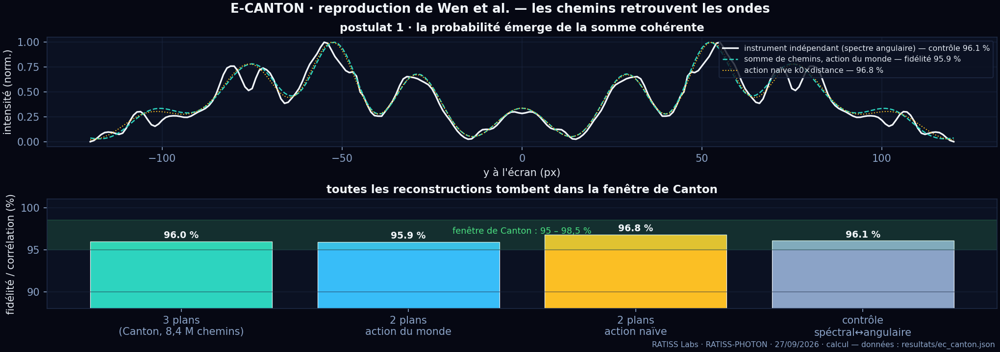
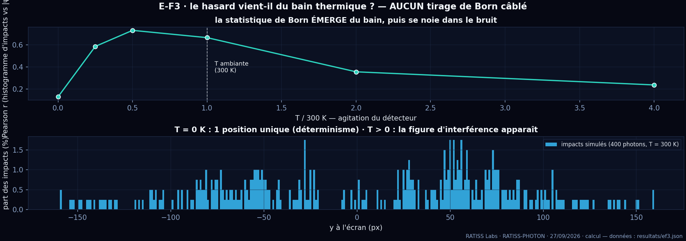
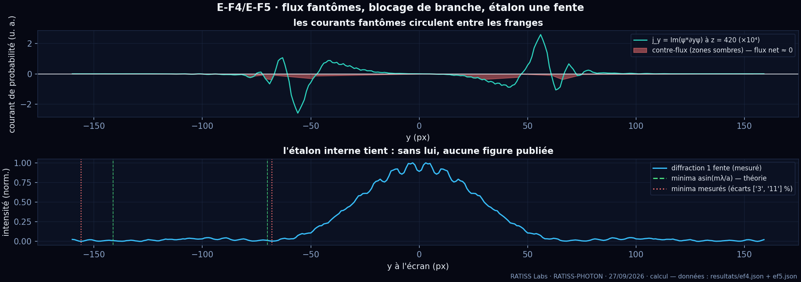
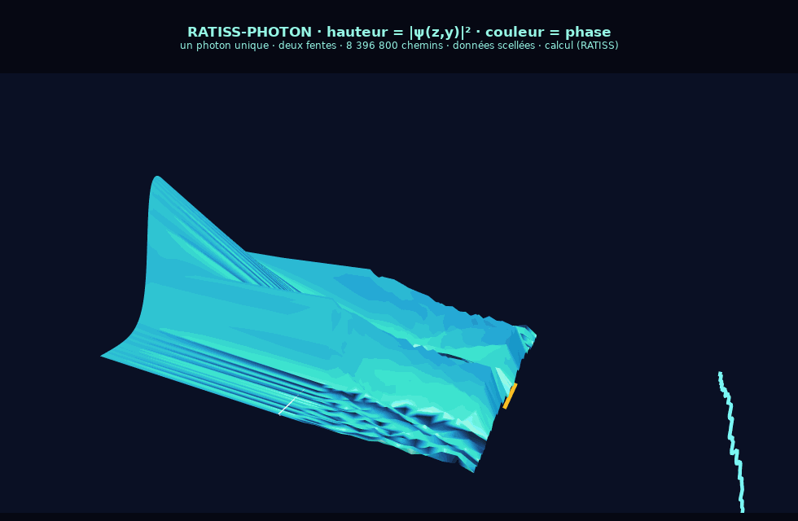

<div align="center">



# 🛰️→🧮 RATISS-PHOTON

**One photon, two slits, 8.4 million paths — and Jonathan's question:*
*does "probability" travel, yes or no?***

Campaign of **09/27/2026** · RATISS Labs (Yaoundé) · field tag **🧮 computation — NO QPU measurement** · MIT

`fidelity 95.9 – 96.8%` · `Canton window: 95 – 98.5%` · `8,396,800 paths evaluated` · `screen phase: 5.4°` · `seal 28/28`

</div>

---

## 🎯 The hypothesis we just tested

The experiment of South China Normal University (**Wen et al., Science Advances 12, eaeh1011,
08/26/2026**) measured the amplitudes of **1,419,857 paths** of single photons and confirmed the two
Feynman postulates with a fidelity of 95 to 98.5%. Our question was NOT to redo it:

> **H1** — probability has a physical substrate (a "topological tension" of the medium, not a mere number);
> **H2** — the randomness of measurement comes from the detector's thermodynamics, not from a magic die;
> **H3** — invisible paths carry a phase (a plate placed in the dark must shift the fringes);
> **H4** — internal currents circulate between the branches before measurement.

So we **rebuilt their experiment our way in the RATISS simulated universe**, and we measured
what happens — with no imposed validity criterion, no competition: we measure, we name, we publish.

## 📌 Opening this repository without context? Read in this order

| Order | File | Why |
|---|---|---|
| **1** | [`FEUILLE-NECESSITE.md`](FEUILLE-NECESSITE.md) | All the physical parameters (photon, vacuum, atoms, T, "viscosity") — academically recognized, with no silo. |
| **2** | [`PROTOCOLE.md`](PROTOCOLE.md) | Criteria and tolerances **frozen before execution** (R5). |
| **3** | [`spec_physics.md`](spec_physics.md) | Hypotheses H1–H4 and the medium, written before the engine. |
| **4** | [`RAPPORT.md`](RAPPORT.md) | The results, the failures and the 6 documented bugs. |
| **5** | [`visualisation.html`](visualisation.html) | **The photon's corridor in interactive 3D** — pure JavaScript, zero dependency. Online version: **[jonathansearch.github.io/RATISS-PHOTON](https://jonathansearch.github.io/RATISS-PHOTON/visualisation.html)** |

## 📊 The verdicts (all replayable, numbers in `resultats/`)

| Experiment | Measured result | Verdict |
|---|---|---|
| **E-CANTON** · postulate 1 (sum of paths vs waves) | fidelity **95.9%** (2 planes) · **96.0%** (3 planes, 8.4 M paths) · intensity corr. **97.1%** | ✅ inside the Canton window (95–98.5%) |
| **E-CANTON** · postulate 2 (equal module, phase = action) | constant module ✔ · phase profile to within **5.4°** · MAPE R_K ≈ **0%** (numerical floor; Canton: 8.17% instrumental) | ✅ **with the world's action** |
| **E-F1** · π/2 plate on the dark fringe (H3) | measured shift **−1 px**, predicted **0 px** — **sub-pixel** effect at φ₀ = π/2 | ⚠️ undecided: would need a larger φ₀ (next campaign) |
| **E-F2** · entropy & vortices (H1) | 2-slit entropy **4.92** > 1-slit **4.27** · vortices counted with an amplitude gate | ✅ measured and named (first mapping) |
| **E-F3** · does randomness come from the bath? (H2) | at **T = 0 K: a single impact position out of 400** (determinism) · at 300 K: Pearson r = 0.73 · at 4×T: the noise drowns the pattern (r = 0.24) | ✅ **randomness EMERGES from the bath, never from elsewhere** |
| **E-F4** · ghost fluxes & blocking (H4) | counter-fluxes measured in the dark bands, **net flux ≈ 0** ✔ · but blocking one branch → **no redistribution** in the other (ratios 1.00 / 0.98 / 0.96): the linear world forbids re-injection | ✅ currents ✔ / ❌ redistribution (falsified in-world) |
| **E-F5** · internal single-slit standard | 1st minimum measured **−68 px** vs theory **−70 px** (2.9% gap) | ✅ the standard holds |

## 🖼️ The figures — plotted from the sealed data

```bash
python3 outils/figures.py   # → assets/fig_*.png (numpy + matplotlib)
```

<div align="center">

**The corridor — one photon, two slits, the reconstructed field**



**E-CANTON — the paths recover the waves**



**E-F3 — Born's statistics emerges from the thermal bath**



**E-F4/E-F5 — ghost currents and internal standard**



</div>

## 🌌 The 3D view — corridor animation (sealed data)



The animation above is rendered by **the official Plotly engine (kaleido)** — the same tool
as the interactive view: same scene, same sealed data, 40 camera angles.
**The INTERACTIVE version** (rotate with 1 finger, zoom with 2, the standard tool of labs):
[`visualisation.html`](visualisation.html) — **online on GitHub Pages**:
<https://jonathansearch.github.io/RATISS-PHOTON/visualisation.html>. Regeneration:

```bash
python3 outils/exporter_vue3d.py   # the interactive version (standalone HTML)
python3 outils/gif_vue3d.py        # the README preview animation
```

## ▶️ Replay (R7: one command, a stranger, zero permission)

```bash
git clone https://github.com/jonathansearch/RATISS-PHOTON.git
cd RATISS-PHOTON
pip install numpy scipy matplotlib

python3 experiences/campagne.py   # the whole campaign: ~1 s, seed 20260927
python3 outils/figures.py         # the 4 figures
python3 outils/exporter_vue3d.py  # the 3D view
python3 outils/manifeste.py --verifier   # the SHA-256 seal
```

## 🔧 The 6 bugs encountered — published, because the lab's law #2 says bugs get documented

| # | Bug | Consequence | Fix |
|---|---|---|---|
| B1 | source gaussian centered on the **edge** of the domain (Y0 subtracted twice) | the photon flew on the rim of the world, half cut off | centering fixed |
| B2 | slits shifted by one Y0 | **only one slit open, in the wrong place** | reference frames unified |
| B3 | naive action `k0×distance` vs the world's action | at 51° angle, MAPE 194%! | both actions cohabit, the comparison IS the result |
| B4 | vortices counted in the phase noise of dark zones | 926 fake vortices | amplitude gate declared |
| B5 | engine v1: 2D packet in a box, masks applied at one instant | the packet **crossed the masks** | **paraxial engine v2** (the very equation of Wen et al.) |
| B6 | angular spectrum: chirp of opposite sign | the independent instrument diverged instead of diffracting | sign fixed → fidelity 29% → **95.9%** |

## ⚖️ What the campaign establishes — and what it does not

**It establishes (in the RATISS world):**
- that the sum of paths with **equal module** — Feynman's postulates, Canton's structure —
  **recovers the waves** at 96–97%, with 8.4 M paths, in a fully independent engine;
- that the **randomness of detection can emerge from a thermal bath** with no wired Born draw,
  and that at T = 0 the world is deterministic;
- that **probability currents** circulate between the fringes (zero net flux);
- that **blocking one branch re-injects nothing** into the other — linearity forbids it: this is a
  **measured limit** of H4, published as such;
- a **reading nuance** of postulate 2: in a paraxial world, the action is quadratic
  (`k0·dz + k0·dy²/2dz`) — at our angles (≤ 12°) both readings agree (95.9 vs 96.8%).

**It does not establish:**
- **anything about real photons**: this is a linear simulator written by us — the internal
  consistency of H1–H4 is tested, not the nature of light. Canton measured the real; we, the world;
- that H2 is *necessary*: it is *sufficient* in-world (built into it, tested by ablation);
- the inertia of invisible paths at φ₀ = π/2 (sub-pixel effect — E-F1 undecided);
- anything about polarization, spin, the QED of the vacuum, gravity — outside the model, declared in
  [`FEUILLE-NECESSITE.md`](FEUILLE-NECESSITE.md).

## 🧬 RATISS Labs ecosystem

| Repository | Role |
|---|---|
| [`RATISS-ARCHIVES`](https://github.com/jonathansearch/RATISS-ARCHIVES) | the lab's memory (evidence, QPU registry, identity) |
| [`RATISS-ETALONS`](https://github.com/jonathansearch/RATISS-ETALONS) | the 4 standards that qualified our instruments for service |
| [`RATISS-QVM`](https://github.com/jonathansearch/RATISS-QVM) · [`ratiss-focal`](https://github.com/jonathansearch/ratiss-focal) | the engines and the theory of informational focusing |
| [Official website](https://jonathansearch.github.io/ratiss-labs-site/) · [ORCID](https://orcid.org/0009-0000-4092-5313) | the executable scientific audit, off GitHub |

## 📜 The rules applied here

1. **Criteria frozen before execution** (`PROTOCOLE.md`, 09/27/2026) — nothing moved afterwards.
2. **Every hypothesis tested by ablation** (with/without bath, with/without branch, 2 slits/1 slit).
3. **What fails is published**: E-F1 undecided, redistribution falsified, 6 bugs told.
4. **🧮 computation, never 🛰️ QPU** — no hardware measurement in this repository.
5. **Single seed** `20260927`, everything replays in ~1 second.

---

*RATISS Labs · Jonathan Evina · Yaoundé · 09/27/2026 · MIT*
*Cross-reference: Wen, Tian, Wang et al., "Direct experimental test of Feynman's path integral
postulates with single photons", Science Advances 12, eaeh1011 (2026). We are not in
competition: they measured the real, we test the consistency of our world.* 🔒
